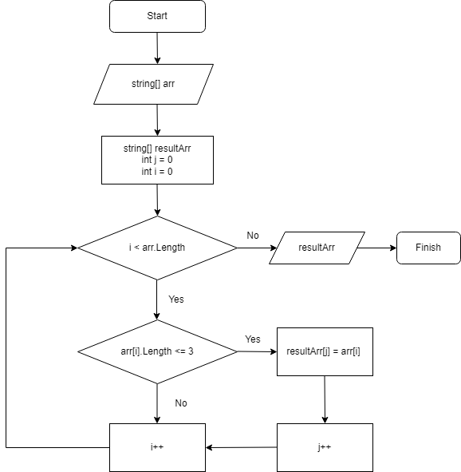

# **Задача**
Написать программу, которая из имеющегося массива строк формирует массив из строк, длина которых меньше либо равна 3 символа. Первоначальный массив можно ввести с клавиатуры, либо задать на старте выполнения алгоритма. При решении не рекомендуется пользоваться коллекциями, лучше обойтись исключительно массивами.

# **Алгоритм**
1.	На входе массив строк. Создаем новый массив такой же длины как у имеющегося.
2.	Создаем переменную j для нового массива.
3.	Перебираем имеющийся массив с помощью оператора for.
4.	Внутри цикла условие: длина строки должна быть меньше либо равна 3 символам. Если стока удовлетворяет данному условию, кладем значение в новый массив и увеличиваем переменную j на 1. Интератор i увеличивается вне зависимости от условия.
6.	4 пункт выполняем до тех пор, пока не переберем исходный массив.
7.	Возвращаем новый заполненный массив с длиной строк <=3.

# **Блок-схема**

